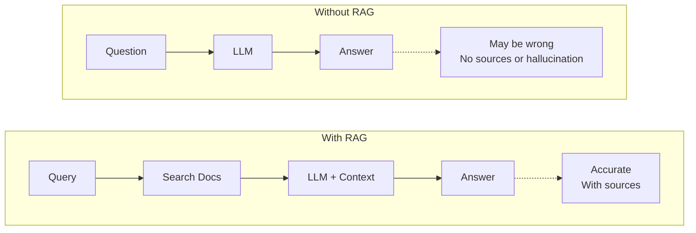
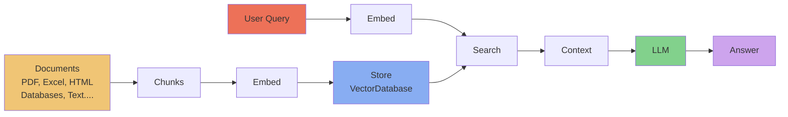

# RAG Traditional - Retrieval-Augmented Generation System

[](https://www.python.org/downloads/)
[](https://python.langchain.com/)
[](LICENSE)
[](https://groq.com/)

A production-ready Retrieval-Augmented Generation (RAG) system built with LangChain, featuring multiple vector stores (FAISS & ChromaDB), PDF processing capabilities, and integration with Groq's high-performance LLMs.

---

##  Table of Contents

- [What is RAG?](#what-is-rag)
- [Why RAG?](#why-rag)
- [How RAG Works](#how-rag-works)
- [Features](#features)
- [Architecture](#architecture)
- [Project Structure](#project-structure)
- [Tech Stack](#tech-stack)
- [Prerequisites](#prerequisites)
- [Installation](#installation)
- [Configuration](#configuration)
- [Usage](#usage)
- [Vector Stores Comparison](#vector-stores-comparison)
- [Embeddings](#embeddings)
- [Advanced Features](#advanced-features)
- [Performance Optimization](#performance-optimization)
- [Troubleshooting](#troubleshooting)
- [Roadmap](#roadmap)
- [Resources](#resources)
- [License](#license)

---

## What is RAG?

**RAG (Retrieval-Augmented Generation)** is an AI framework that enhances Large Language Models (LLMs) by combining them with external knowledge retrieval systems. Instead of relying solely on pre-trained knowledge, RAG retrieves relevant information from external documents and uses it to generate more accurate, contextual, and up-to-date responses.

### The Problem RAG Solves:

Traditional LLMs face several limitations:
-  **Knowledge Cutoff**: Limited to training data up to a specific date
-  **Hallucinations**: May generate plausible but incorrect information
-  **No Domain-Specific Knowledge**: Cannot access private/proprietary data
-  **Inability to Update**: Retraining is expensive and time-consuming

### The RAG Solution:

- **Current Information**: Access real-time or recently updated documents  
- **Factual Accuracy**: Ground responses in actual source material  
- **Domain Expertise**: Leverage private knowledge bases  
- **Cost-Effective**: No need to retrain models  
- **Transparent**: Cite sources for generated answers  

---

## Why RAG?

### Use Cases Where RAG Excels:

#### 1. **Enterprise Knowledge Management**
- Internal documentation Q&A
- Employee handbook assistance
- Policy and compliance queries

#### 2. **Customer Support**
- Product documentation chatbots
- Technical support automation
- FAQ answering systems

#### 3. **Research & Analysis**
- Scientific paper analysis
- Legal document review
- Financial report summarization

#### 4. **Education**
- Textbook question answering
- Study material assistance
- Course content exploration

#### 5. **Healthcare**
- Medical literature search
- Clinical guidelines reference
- Patient education materials

---

## How RAG Works

### Traditional LLM vs RAG:




### RAG Pipeline Steps:

1. **Document Ingestion**: Load and process PDF/text documents
2. **Chunking**: Split documents into manageable pieces
3. **Embedding**: Convert text chunks into vector representations
4. **Indexing**: Store embeddings in vector database (FAISS/ChromaDB)
5. **Query Processing**: Convert user query into embedding
6. **Retrieval**: Find most similar document chunks
7. **Augmentation**: Combine retrieved context with query
8. **Generation**: LLM generates answer using retrieved context
9. **Response**: Return answer with source citations

---

##  Features

### Core Capabilities
- **PDF Processing**: Extract text from PDF documents using PyMuPDF and PyPDF
- **Semantic Search**: Find relevant information using sentence embeddings
- **Dual Vector Stores**: Support for both FAISS and ChromaDB
- **High-Performance LLM**: Integration with Groq for fast inference
- **LangChain Integration**: Modular, production-ready RAG pipeline
- **Persistent Storage**: Save and load vector indices
- **Jupyter Notebooks**: Interactive experimentation and analysis

### Advanced Features
- **Batch Processing**: Handle multiple documents efficiently
- **Relevance Scoring**: Rank retrieved documents by similarity
- **Incremental Updates**: Add documents without rebuilding entire index
- **Configurable Chunking**: Adjust chunk size and overlap
- **Performance Metrics**: Track retrieval and generation metrics

---

## Architecture

### System Architecture



---

## Project Structure

```
rag-traditional/
│
├── data/                      # Document storage
│   ├── raw/                      # Original PDF/text files
│   ├── processed/                # Processed documents
│   └── vectors/                  # Saved vector indices
│       ├── faiss_index/          # FAISS index files
│       └── chroma_db/            # ChromaDB persistent storage
│
├── notebook/                  # Jupyter notebooks
│   ├── 01_data_ingestion.ipynb   # PDF loading experiments
│   ├── 02_embeddings.ipynb       # Embedding comparisons
│   ├── 03_vector_stores.ipynb    # FAISS vs ChromaDB
│   └── 04_rag_pipeline.ipynb     # End-to-end RAG testing
│
├── .venv/                     # Virtual environment (isolated)
│
├── main.py                    # Main application entry point
├── requirements.txt           # Python dependencies (pip)
├── pyproject.toml             # Project metadata (uv/pip)
├── uv.lock                    # Lock file for reproducibility
├── .env                       # Environment variables (API keys)
├── .env.example               # Template for environment setup
├── .gitignore                 # Git ignore rules
├── .python-version            # Python version (3.12+)
├── README.md                  # This file
└── LICENSE                    # MIT License

```

### File Descriptions

| File/Folder | Purpose |
|-------------|---------|
| `data/` | Stores all documents, processed data, and vector indices |
| `notebook/` | Jupyter notebooks for experimentation and analysis |
| `main.py` | Core RAG application logic and CLI interface |
| `requirements.txt` | Python package dependencies for pip |
| `pyproject.toml` | Project configuration (supports uv and pip) |
| `.env` | API keys and configuration (never commit!) |
| `.venv/` | Isolated Python environment with installed packages |

---

## Tech Stack

| Component | Technology | Purpose | Why Chosen |
|-----------|-----------|---------|------------|
| **Core Framework** | LangChain 1.0+ | RAG orchestration | Industry standard, modular, extensible |
| **LLM Provider** | Groq | Fast inference | 1000+ tokens/sec, cost-effective |
| **Embeddings** | Sentence Transformers | Text vectorization | State-of-the-art semantic search |
| **Vector Store #1** | FAISS | In-memory search | Fastest similarity search, Facebook-backed |
| **Vector Store #2** | ChromaDB | Persistent storage | Easy metadata filtering, auto-persistence |
| **PDF Parser #1** | PyMuPDF (fitz) | Primary PDF extraction | Fast, accurate, handles complex layouts |
| **PDF Parser #2** | PyPDF | Fallback parser | Lightweight, pure Python |
| **Environment** | python-dotenv | Config management | Secure API key handling |
| **Package Manager** | uv (optional) | Dependency management | 10-100x faster than pip |

---

## Prerequisites

### Required
- **Python**: 3.12 or higher ([Download](https://www.python.org/downloads/))
- **pip**: Python package manager (included with Python)
- **Git**: Version control ([Download](https://git-scm.com/))

### Optional
- **uv**: Ultra-fast Python package manager ([Install](https://github.com/astral-sh/uv))
- **Jupyter**: For running notebooks ([Included in requirements](https://jupyter.org/))

### API Keys
You'll need a **Groq API key** (free tier available):
1. Visit [console.groq.com](https://console.groq.com/)
2. Sign up for a free account
3. Generate an API key
4. Keep it secure (never commit to Git!)

---

## Installation

### Option A: Using uv (Recommended - Faster)

```bash
# 1. Clone repository
git clone https://github.com/Selvam-DG/rag-traditional.git
cd rag-traditional

# 2. Install uv (if not already installed)
curl -LsSf https://astral.sh/uv/install.sh | sh

# 3. Create virtual environment and install dependencies
uv venv
source .venv/bin/activate  # On Windows: .venv\Scripts\activate
uv pip install -r requirements.txt
```

### Option B: Using pip (Traditional)

```bash
# 1. Clone repository
git clone https://github.com/yourusername/rag-traditional.git
cd rag-traditional

# 2. Create virtual environment
python -m venv .venv
source .venv/bin/activate  # On Windows: .venv\Scripts\activate

# 3. Upgrade pip and install dependencies
pip install --upgrade pip
pip install -r requirements.txt
```

### Verify Installation

```bash
python -c "import langchain; import chromadb; import faiss; print('All packages installed successfully!')"
```

---

## Configuration

### 1. Create Environment File

```bash
# Copy example file
cp .env.example .env

# Edit with your API key
nano .env  # or use your preferred editor
```

### 2. Set Environment Variables

```bash
# .env file contents
GROQ_API_KEY=your_groq_api_key_here

# Optional configurations
EMBEDDING_MODEL=all-MiniLM-L6-v2
CHUNK_SIZE=1000
CHUNK_OVERLAP=200
TOP_K_RESULTS=3
```

### 3. Prepare Your Documents

```bash
# Create data directory structure
mkdir -p data/raw data/processed data/vectors

# Add your PDF files
cp /path/to/your/documents/*.pdf data/raw/
```

---

## Usage

### Basic Usage

```python
from main import RAGSystem

# Initialize RAG system
rag = RAGSystem(
    vector_store="faiss",  # or "chromadb"
    embedding_model="all-MiniLM-L6-v2"
)

# Load documents
rag.load_documents("data/raw")

# Ask questions
response = rag.query("What are the main findings in the research paper?")
print(response)
```

### Command Line Interface

```bash
# Index documents
python main.py --index data/raw

# Query the system
python main.py --query "What is the summary of the document?"

# Use specific vector store
python main.py --vector-store chromadb --query "Explain the methodology"
```

### Using Jupyter Notebooks

```bash
# Start Jupyter
jupyter notebook

# Open notebooks in browser
# Navigate to notebook/ folder
# Run cells sequentially
```

---

## Vector Stores Comparison

### FAISS vs ChromaDB

| Feature | FAISS | ChromaDB | Winner |
|---------|-------|----------|--------|
| **Speed** |  Extremely fast |  Moderate | FAISS |
| **Memory** |  In-memory |  Persistent | ChromaDB |
| **Scalability** |  Billions of vectors |  Millions of vectors | FAISS |
| **Metadata** |  Limited |  Rich filtering | ChromaDB |
| **Persistence** | Manual save/load |  Auto-persist | ChromaDB |
| **Updates** |  Rebuild required |  Incremental | ChromaDB |
| **Setup** |  Simple |  Simple | Tie |
| **GPU Support** |  Yes |  No | FAISS |

### When to Use Each

**Use FAISS when:**
- You need maximum search speed
- Working with large-scale datasets (millions+ vectors)
- In-memory operation is acceptable
- Metadata filtering is not critical
- GPU acceleration is available

**Use ChromaDB when:**
- You need persistent storage
- Metadata filtering is important
- Incremental updates are frequent
- Building a production system
- Multi-user scenarios

---

##  Embeddings

### Sentence Transformers

This project uses **all-MiniLM-L6-v2** as the default embedding model:

**Specifications:**
- **Dimensions**: 384
- **Max Tokens**: 256
- **Performance**: Fast inference (~2500 sentences/sec)
- **Quality**: High semantic similarity accuracy
- **Size**: ~80MB model

### Changing Embedding Model

```python
from sentence_transformers import SentenceTransformer

# Load different model
embeddings = SentenceTransformer('all-mpnet-base-v2')

# Use in RAG system
rag = RAGSystem(embedding_model='all-mpnet-base-v2')
```

---

##  Advanced Features

### 1. Custom Chunking Strategy

```python
from langchain.text_splitter import RecursiveCharacterTextSplitter

text_splitter = RecursiveCharacterTextSplitter(
    chunk_size=1000,        # Characters per chunk
    chunk_overlap=200,      # Overlap between chunks
    length_function=len,
    separators=["\n\n", "\n", " ", ""]
)
```

### 2. Hybrid Search (Keyword + Semantic)

```python
# Combine BM25 with vector search
from langchain.retrievers import BM25Retriever, EnsembleRetriever

bm25_retriever = BM25Retriever.from_documents(documents)
vector_retriever = vectorstore.as_retriever()

ensemble = EnsembleRetriever(
    retrievers=[bm25_retriever, vector_retriever],
    weights=[0.3, 0.7]  # Favor semantic search
)
```

### 3. Re-ranking Retrieved Documents

```python
from sentence_transformers import CrossEncoder

reranker = CrossEncoder('cross-encoder/ms-marco-MiniLM-L-6-v2')

# Score and re-rank results
scores = reranker.predict([(query, doc) for doc in retrieved_docs])
reranked = sorted(zip(retrieved_docs, scores), key=lambda x: x[1], reverse=True)
```

### 4. Multi-Query Retrieval

```python
from langchain.retrievers.multi_query import MultiQueryRetriever

retriever = MultiQueryRetriever.from_llm(
    retriever=vectorstore.as_retriever(),
    llm=llm
)
# Generates multiple query variations for better recall
```

---

## Performance Optimization

### 1. Batch Processing

```python
# Process documents in batches
batch_size = 100
for i in range(0, len(documents), batch_size):
    batch = documents[i:i+batch_size]
    vectorstore.add_documents(batch)
```

### 2. Caching

```python
from langchain.cache import InMemoryCache
import langchain

# Enable LLM caching
langchain.llm_cache = InMemoryCache()
```

### 3. Async Operations

```python
import asyncio

async def process_queries(queries):
    tasks = [rag.aquery(q) for q in queries]
    return await asyncio.gather(*tasks)
```

### 4. Index Optimization

```bash
# For FAISS: Use IVF index for large datasets
import faiss
quantizer = faiss.IndexFlatL2(dimension)
index = faiss.IndexIVFFlat(quantizer, dimension, nlist)
```

---

##  Troubleshooting

### Common Issues

#### 1. Import Error: No module named 'langchain'
```bash
# Solution: Ensure virtual environment is activated
source .venv/bin/activate
pip install -r requirements.txt
```

#### 2. GROQ_API_KEY not found
```bash
# Solution: Check .env file exists and is loaded
cat .env
# Ensure no spaces around = in .env file
```

#### 3. PDF extraction fails
```python
# Solution: Try alternative parser
from PyPDF2 import PdfReader
reader = PdfReader("document.pdf")
text = "\n".join([page.extract_text() for page in reader.pages])
```

#### 4. Out of memory with FAISS
```bash
# Solution: Use quantization or switch to ChromaDB
vectorstore = Chroma(persist_directory="data/vectors/chroma_db")
```

#### 5. Slow embedding generation
```python
# Solution: Use smaller model or batch process
embeddings = SentenceTransformer('all-MiniLM-L6-v2')  # Faster than mpnet
embeddings.encode(texts, batch_size=32, show_progress_bar=True)
```

---

##  Roadmap

### Completed 
- [x] Basic RAG pipeline
- [x] ChromaDB integration
- [x] PDF processing (PyMuPDF + PyPDF)
- [x] Sentence Transformers embeddings
- [x] Groq LLM integration
- [x] Jupyter notebooks for experimentation

### In Progress 
- [ ] Web interface (Streamlit/Gradio)
- [ ] Conversation history management
- [ ] Source citation in responses
- [ ] Performance metrics dashboard

### Planned 
- [ ] Advanced chunking strategies
- [ ] Hybrid search (BM25 + semantic)
- [ ] Re-ranking with cross-encoders
- [ ] Multi-modal RAG (images + text)
- [ ] Agent-based RAG with tool use
- [ ] Evaluation framework (RAGAS)
- [ ] Docker containerization
- [ ] REST API with FastAPI
- [ ] Authentication and rate limiting
- [ ] Cloud deployment guides

---

##  Testing

### Run Tests

```bash
# Unit tests
pytest tests/

# Integration tests
pytest tests/integration/

# With coverage
pytest --cov=. tests/
```

### Example Test

```python
def test_rag_pipeline():
    rag = RAGSystem(vector_store="faiss")
    rag.load_documents("data/raw/sample.pdf")
    
    response = rag.query("What is the main topic?")
    
    assert response is not None
    assert len(response) > 0
```


---

##  Resources

### Official Documentation
- [LangChain Documentation](https://python.langchain.com/)
- [FAISS GitHub](https://github.com/facebookresearch/faiss)
- [ChromaDB Documentation](https://docs.trychroma.com/)
- [Sentence Transformers](https://www.sbert.net/)
- [Groq API Documentation](https://console.groq.com/docs)

### Learning Resources
- [RAG Fundamentals](https://www.youtube.com/watch?v=T-D1OfcDW1M) - LangChain Tutorial
- [Building RAG from Scratch](https://www.youtube.com/watch?v=sVcwVQRHIc8) - DeepLearning.AI
- [Advanced RAG Techniques](https://www.youtube.com/watch?v=bjb_EMsTDKI) - LlamaIndex

### Research Papers
- [Retrieval-Augmented Generation for Knowledge-Intensive NLP Tasks](https://arxiv.org/abs/2005.11401)
- [Dense Passage Retrieval for Open-Domain Question Answering](https://arxiv.org/abs/2004.04906)

### Community
- [LangChain Discord](https://discord.gg/langchain)
- [r/LocalLLaMA](https://www.reddit.com/r/LocalLLaMA/)
- [Groq Community](https://console.groq.com/docs/community)

---

##  License

This project is licensed under the **MIT License** - see the [LICENSE](LICENSE) file for details.

```
MIT License

Copyright (c) 2025 Your Name

Permission is hereby granted, free of charge, to any person obtaining a copy
of this software and associated documentation files (the "Software"), to deal
in the Software without restriction...
```

---

##  Acknowledgments

- **LangChain Team**: For the excellent framework
- **Groq**: For providing blazing-fast LLM inference
- **Hugging Face**: For Sentence Transformers
- **Meta AI**: For FAISS vector search
- **ChromaDB Team**: For the user-friendly vector database
- **YouTube Creators**: For educational content that inspired this project

---


## Why I Built This

> Traditional LLMs are amazing, but they're limited by their training data. RAG unlocks the ability to use LLMs with your own documents - whether it's company policies, research papers, or personal knowledge bases.

### My Goals:
- Learn RAG fundamentals by building from scratch  
- Compare vector store options (FAISS vs ChromaDB)  
- Experiment with different embedding models  
- Create a production-ready template for RAG projects  
- Share knowledge with the community  

---

<div align="center">

### ⭐ If you found this helpful, please star the repo!

**Made with ❤️ by a developer learning RAG**

[⬆ Back to Top](#rag-traditional---retrieval-augmented-generation-system)

</div>